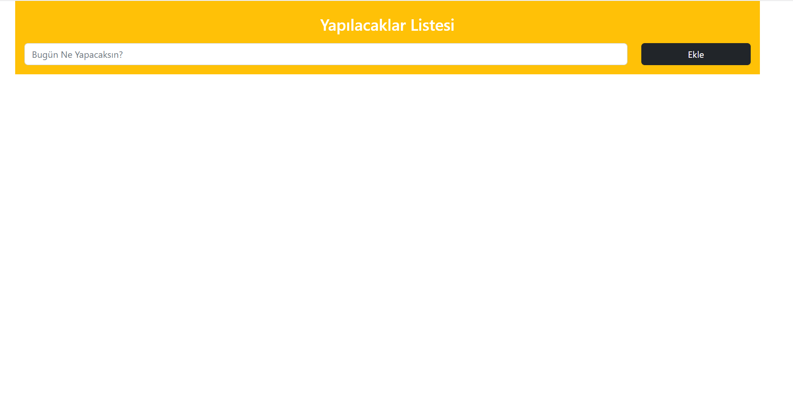
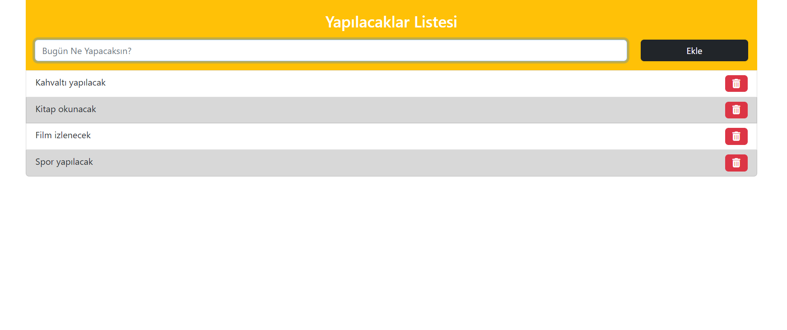
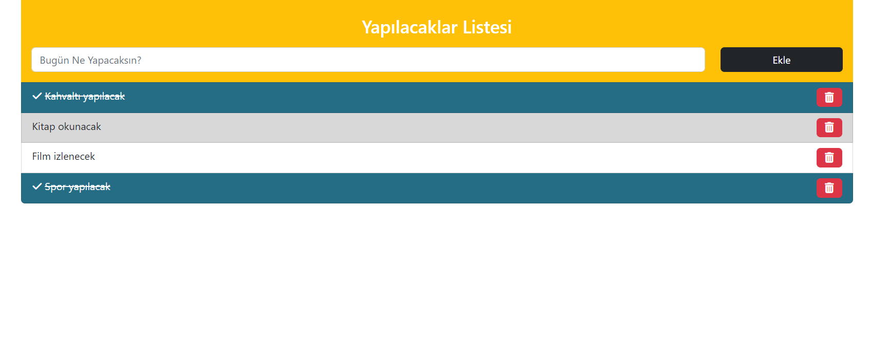
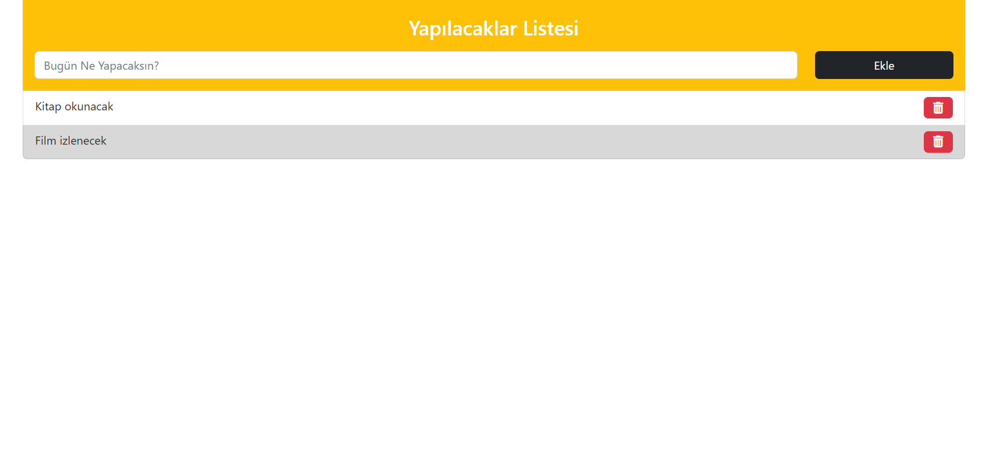

# ToDo List
It is a project that enables the following features:
- It helps us create a to-do list.
- Allows us to cross out the actions we have taken.
- Allows us to remove actions that we have completed from the list.

## Pictures of the project

### Normal state of the website 

### The state of the website after adding the elements

### The state of the website after crossing out elements

### The state of the website after removing the elements

---------------------

 **
 NOTE 
**
Since I have included ***Local Storage*** in the project, the final version of the list is seen when the browser is refreshed.

--------------------

If you want to try the website, [Click Me.](https://to-do-list-ten-red.vercel.app/)

*
 - Author: [Berkay Emre BOĞUM](https://www.linkedin.com/in/berkay-emre-bo%C4%9Fum-058782240/) 
*

